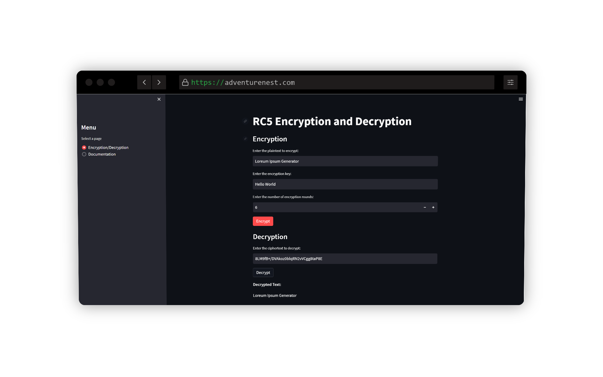

# ⚙️ RC5 Cryptosystem


# 📝 About
This project implements the RC5 encryption and decryption algorithm using Python. It provides a user-friendly web interface built with Streamlit, allowing users to encrypt and decrypt text using the RC5 algorithm.

## 💻 Features

- Encryption: Encrypt plaintext using the RC5 algorithm.
- Decryption: Decrypt ciphertext using the RC5 algorithm.
- Key Scheduling: Generate the key schedule required for encryption and decryption.
- Variable Number of Rounds: Customize the number of encryption rounds for increased security.

## 📚 Tech Stack
- Python
- Streamlit
  
## 🔨 Commands 

## Web Client
To run the web client, you need to have streamlit installed. Then, you need to install the dependencies by running the following command in the web folder:
```
    pip install streamlit
    streamlit run app.py
```

## 🤖 Python Client
Run the EXE file directly or run the following command in the src folder:
```
    python app.py
```

If you want to create exe use pyinstaller:
```
    pip install pyinstaller
    pyinstaller app.py
```

## 📝 License
[](https://opensource.org/licenses/MIT)

## 

